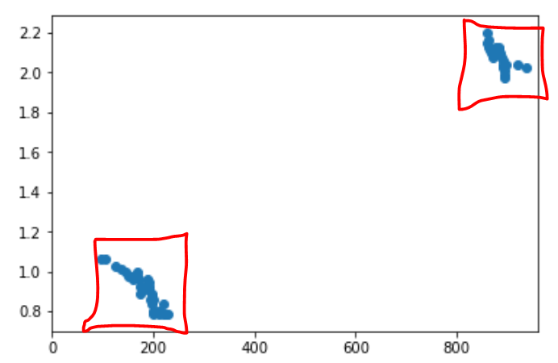

# **Finding Lane Lines on the Road - Project writeup**

## Project goals

The goals / steps of this project are the following:
1. Make a pipeline that finds lane lines on the road
1. Improve the pipeline, to find lanes as exactly two lines
1. (Optional) Further improve the pipeline to deal with varying light conditions, as in `challenge.mp4`

## Results

The code for this project is in the notebook [P1.ipynb](P1.ipynb)

1. The first version of the pipeline was implemented with the same steps as shown in class. Here are the results for [images](./test_images_output_first) and [videos](./test_videos_output_first). It detects line segments belonging to the lanes, but not the lanes themselves.

1. The second version of the pipeline was improved to find the exactly two lines, corresponding to the position and slope of the lanes. Here are the results for [images](./test_images_output_second) and [videos](./test_videos_output_second).

## Reflection

### Pipeline v1

The initial version of the pipeline followed the one presented in class. It's implemented in the notebook as `process_image()`. The steps are:

1. Resize image to (960, 540). This is to handle `challenge.mp4`
1. Convert to grayscale
1. Apply Gaussian blur (5)
1. Apply Canny filter (50, 150)
1. Cut region of interest ((0, 540), (350, 350), (610, 350), (960, 540))
1. Extract Hough lines (2, PI/180, 15, 40, 20)
1. Draw the lines using `draw_lines` helper function

It results in a pretty good detection of line segments belonging to the lanes. Here are the results for [images](./test_images_output_first) and [videos](./test_videos_output_first).

Here is a YouTube upload that can be viewed directly - the only way I could find to embed video in markdown on Github:

### Pipeline v2

#### Thought process

Even though the task says to improve `draw_lines()` function, my approach is slightly different. In my opinion, the problem with v1 is not the drawing, but that the pipeline doesn't _actually_ find the lanes. It only finds line segments that most likely belong to the lanes.

Thinking about Hough transform, I realized that the raw `(rho, theta)` representation would be most useful for the task, because it responds to _whole lines_ and not _line segments_ - which is what we want. If we had the raw Hough-transformed representation, we could potentially run a clustering algorithm to find two clusters with most intensity - which should correspond to our lanes.

In fact `cv2.HoughLines` function (not `cv2.HoughLinesP`) is roughly what we want. It doesn't quite return raw intensity in `(rho, theta)` space, but it does return a list of points in Hough space that exceed threshold.

Here is an example input after Canny transform:

If we run it through `cv2.HoughLines(img, 1, np.pi/180, 30)`, we get:

We can clearly see clusters, corresponding to straight lines accross the image. Converting back to the image space, for interest:

Additionally, we would like to filter around the regions, where we expect the lanes to be. `\rho` is not a particularly good parameter for that. We can transform `(rho, theta)` to `(x, theta)` where `x` is the coordinate where the line intersects the bottom of the image. We defined this in `transform_hough()` helper function. Here is what we get:

In this space we have a very intuitive interpretation of the points: `x` is the position of the lane on the bottom of the image, and `theta` is the angle.

Now we can very easily filter the points around these regions using rectangle bounds, and take their mean.

#### Resulting pipeline

This logic is implemented as `process_image2()`. The beggining is the same as before:

1. Resize image to (960, 540)
1. Convert to grayscale
1. Apply Gaussian blur (5)
1. Apply Canny filter (50, 150)
1. Cut region of interest ((0, 540), (350, 350), (610, 350), (960, 540))

And now we have the new logic:

6. Extract Hough lines with `cv2.HoughLines(img, 1, np.pi/180, 30)`, which gives us array of `(rho, theta)` points.
7. Transform to `(x, theta)` space
8. Identify left lane as the average of points in `(x=[0, 480], theta=[30°, 80°])` rectangle
9. Identify right lane as the average of points in `(x=[480, 960], theta=[50°, 150°])` rectangle
10. Draw the two lines using `draw_lines_xtheta` helper function.

This works nicely on the test images and videos (except the challenge video). Here are the results for [images](./test_images_output_second) and [videos](./test_videos_output_second).

### Potential shortcomings

One shortcoming is sensitivity to lighting conditions, as seen clearly in the challenge video. We need a more robust way to detect the edges.

Another potential problem is that the detected line is not fully stable and jiggles a bit in the video. It seems to be affected by various extra features on the road - for example, small paint markings near the left yellow lane. 

In general, we should add a lot more safety checks, to make the algorithm more robust - would definetly not trust my autopilot with the current implementation :)

### Possible improvements

I'm not fully happy with `HoughLines` implementation in OpenCV, because I have to specify a fixed threshold (30), and it returns all points without the weights. From that output it is impossible to distinguish strong line signal (e.g. >100 points) from the weak one (only 30 points), which are more likely to be false-positives. What I would like to get is all `(rho, theta)` points with raw weights, without specifying threshold, and then use that output to detect the most likely clusters.

One way to make the algorithm more robust when processing video would be to make it "remember" results from previous frames. For example, we could calculate a moving average over time with ~1sec time decay, because we don't expect the lanes to change rapidly, or the car to react to that.
